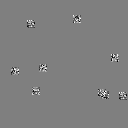
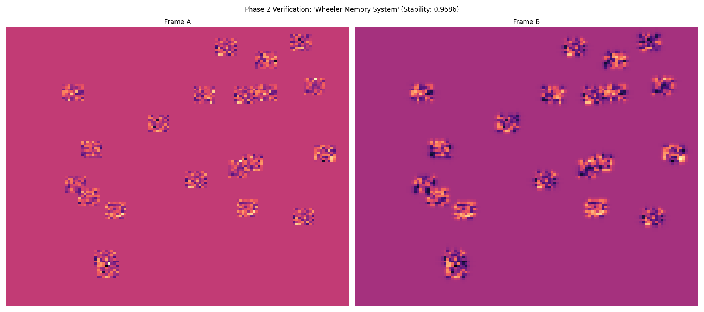

# Wheeler Memory

**A biological-grade associative memory system for AI — a digital hippocampus.**

Wheeler Memory decouples "memory" from "model," giving any AI agent a persistent, evolving, stability-weighted history of experiences. It is not RAG. There is no "save text, search later" step. Memories are physical attractors in a reaction-diffusion dynamical system — meaning is literally what survives symbolic pressure.

Built on the **Symbolic Collapse Model (SCM)**.

<p align="center">
  
  &nbsp;&nbsp;&nbsp;&nbsp;
  
</p>

<p align="center"><em>Left: A memory evolving through reaction-diffusion dynamics. Right: Two attractor frames showing spatial encoding stability (0.97 correlation).</em></p>

---

## Table of Contents

- [Key Ideas](#key-ideas)
- [Quick Start](#quick-start)
- [How It Works](#how-it-works)
- [Architecture](#architecture)
- [CLI Reference](#cli-reference)
- [Python API](#python-api)
- [Web Dashboard](#web-dashboard)
- [Reasoning Engine](#reasoning-engine)
- [Autonomic System](#autonomic-system)
- [Stability Scoring](#stability-scoring)
- [TWAI — Next-Gen Interface](#twai--next-gen-interface)
- [Project Structure](#project-structure)
- [Testing](#testing)
- [SCM Axioms](#scm-axioms)
- [License](#license)

---

## Key Ideas

- **Memories are attractors, not rows in a database.** Text is spatially encoded into a 128x128 grid, then evolved through reaction-diffusion cellular automata until it settles into a stable pattern. That pattern IS the memory.
- **Recall is physics, not search.** Similarity is measured by Pearson correlation between attractor frames — similar meanings collapse to similar attractors.
- **Stability = meaning.** Memories are scored by how well they survive pressure: re-encoding determinism, dynamics compression survival, and activation frequency.
- **The system dreams.** A background autonomic process consolidates frequently-accessed memories and blends random pairs to discover latent connections.
- **The LLM is not the memory.** Wheeler Memory persists independently of any model. Swap the LLM; the memories remain.

---

## Quick Start

### Prerequisites

- **Linux** (tested on Arch/CachyOS)
- **Python 3.10+**
- **Poetry**

### Install

```bash
git clone https://github.com/fantomx42/friendly-enigma.git wheeler-memory
cd wheeler-memory
poetry install
```

### Store and Recall (Python)

```python
import asyncio
from wheeler.core.memory import WheelerMemory

async def main():
    wm = WheelerMemory(".wheeler")
    await wm.initialize()

    # Store memories — each becomes a unique attractor
    await wm.store("The SCM Axioms state that meaning is what survives pressure.")
    await wm.store("Neural attractors encode stable representations of experience.")

    # Recall by similarity — compares attractor frames, not text
    results = await wm.recall("What is meaning?")
    for r in results:
        print(f"{r['key'][:60]}  (score: {r['score']:.3f}, stability: {r['stability']:.2f})")

asyncio.run(main())
```

### Store and Recall (CLI)

```bash
# Store a memory
wheeler store "Consciousness is the ability to model yourself modeling the world."

# Recall by similarity
wheeler recall "self-awareness"

# Blend two concepts via reasoning engine
wheeler reason "entropy" "information"

# Run autonomic dreaming (consolidation + decay)
wheeler dream --ticks 10

# Visualize attractor evolution as animated GIF
wheeler viz-run "pattern recognition" --steps 30

# Render a stored memory's frame as PNG
wheeler viz <uuid>

# Launch the web dashboard
wheeler dashboard
```

---

## How It Works

```
Text → Spatial Encoding (128x128) → Reaction-Diffusion Dynamics → Attractor → Storage
                                                                       ↓
                                                             Stability-Weighted Recall
                                                                       ↓
                                                             Downstream AI / Agent
```

### 1. Spatial Encoding

Text is converted to a 128x128 2D tensor via the `TextCodec`. Each word is tokenized (case-insensitive, pure alphanumeric), then given a deterministic full-grid noise pattern seeded by SHA256 of the word. All word patterns are summed and normalized by `sqrt(N)`, producing a unique spatial fingerprint for any input text.

This is a bag-of-words encoding — word order doesn't matter, but the spatial pattern is fully deterministic. The same text always produces the same frame.

### 2. Reaction-Diffusion Dynamics

The encoded frame is fed through a cellular automata engine that applies:
- **Laplacian diffusion** (circular padding, 3x3 kernel)
- **tanh activation** (non-linear compression)
- **Exponential decay** (dt=0.1, diffusion=0.2, decay=0.01)

After N steps (default: 10), the system settles into a stable **attractor** — a pattern that no longer changes significantly. The attractor IS the memory. It wasn't stored; the dynamics created it.

### 3. Attractor Storage

The attractor frame is saved as a `.npy` blob (128x128 float32 array) alongside metadata in SQLite:

```sql
memories (id, uuid, key, blob_path, hit_count, stability, confidence, created_at, last_accessed)
```

### 4. Physical Recall

To recall, the query text is encoded and evolved into its own attractor. This query attractor is compared against all stored attractors using **Pearson correlation**. Similar meanings collapse to similar patterns — so "What is meaning?" will surface memories about meaning, pressure, and stability without any keyword matching.

The final recall score combines raw similarity with stability:

```
score = similarity * (0.5 + 0.5 * stability)
```

This means stable, frequently-accessed memories rank higher than ephemeral ones.

---

## Architecture

```
                    ┌─────────────────────┐
                    │   Human / External  │
                    └─────────┬───────────┘
                              │
                              ▼
                   ┌─────────────────────┐
                   │    LLM Interface    │
                   │  (swappable model)  │
                   └─────────┬───────────┘
                             │
                    text in / text out
                             │
              ┌──────────────▼──────────────┐
              │                             │
              │       WHEELER MEMORY        │
              │                             │
              │  ┌───────────────────────┐  │
              │  │     TextCodec         │  │
              │  │  text → 128x128 frame │  │
              │  └───────────┬───────────┘  │
              │              │              │
              │  ┌───────────▼───────────┐  │
              │  │   DynamicsEngine      │  │
              │  │   Reaction-Diffusion  │  │
              │  │   → finds attractor   │  │
              │  └───────────┬───────────┘  │
              │              │              │
              │  ┌───────────▼───────────┐  │
              │  │   StorageController   │  │
              │  │   SQLite + .npy blobs │  │
              │  └───────────┬───────────┘  │
              │              │              │
              │  ┌───────────▼───────────┐  │
              │  │   ReasoningEngine     │  │
              │  │   blend / contrast /  │  │
              │  │   amplify frames      │  │
              │  └───────────┬───────────┘  │
              │              │              │
              │  ┌───────────▼───────────┐  │
              │  │   AutonomicSystem     │  │
              │  │   consolidation +     │  │
              │  │   dreaming (bg loop)  │  │
              │  └───────────────────────┘  │
              │                             │
              └─────────────────────────────┘
```

The LLM sits **outside** Wheeler Memory. It is an interface — a way to convert between human language and the system. Swap it for any model. Wheeler Memory is the part that persists, learns, and holds meaning.

### Core Modules

| Module | File | Purpose |
|--------|------|---------|
| **TextCodec** | `wheeler/core/codec.py` | Deterministic bag-of-words → 128x128 spatial encoding |
| **DynamicsEngine** | `wheeler/core/engine.py` | Reaction-diffusion CA with Laplacian kernel, tanh activation |
| **WheelerMemory** | `wheeler/core/memory.py` | Main API: store, recall, infer, recall_by_frame |
| **StorageController** | `wheeler/core/storage.py` | Three-tier: MetadataStore (SQLite) + BlobStore (.npy) |
| **ReasoningEngine** | `wheeler/core/reasoning.py` | Frame-level blend, contrast, amplify operations |
| **AutonomicSystem** | `wheeler/core/autonomic.py` | Background consolidation and dreaming loop |
| **Visualization** | `wheeler/core/viz.py` | Frame rendering (matplotlib/seaborn, magma colormap) |

---

## CLI Reference

Wheeler provides a Click-based CLI with seven commands:

### `wheeler store <text>`

Encode text, run dynamics, and persist the attractor.

```bash
wheeler store "Fire is energy released through oxidation."
# → Stored memory: a1b2c3d4-...
```

Options: `--storage` (default: `./.wheeler`)

### `wheeler recall <text>`

Find stored memories similar to the query.

```bash
wheeler recall "combustion" --limit 5
```

Options: `--storage`, `--limit` (default: 3)

### `wheeler reason <text_a> <text_b>`

Blend two concepts and find what the resulting attractor resonates with in memory.

```bash
wheeler reason "entropy" "information"
# → Finds memories related to the intersection of entropy and information
```

Options: `--storage`, `--limit` (default: 3)

### `wheeler dream`

Run N ticks of autonomic processing — consolidation strengthens high-hit memories, dreaming blends random pairs to discover connections.

```bash
wheeler dream --ticks 10
```

Options: `--storage`, `--ticks` (default: 5)

### `wheeler viz <uuid>`

Render a stored memory's attractor frame as a PNG heatmap.

```bash
wheeler viz a1b2c3d4-5678-...
```

Options: `--output` (default: `frame_{uuid[:8]}.png`), `--storage`

### `wheeler viz-run <text>`

Animate the full dynamics evolution of a text encoding as a GIF.

```bash
wheeler viz-run "pattern recognition" --steps 30 --fps 10
```

Options: `--output` (default: `evolution.gif`), `--steps` (default: 30), `--fps` (default: 10)

### `wheeler dashboard`

Launch the Flask web dashboard for browsing stored memories.

```bash
wheeler dashboard --port 5000
```

Options: `--storage`, `--port` (default: 5000)

---

## Python API

### WheelerMemory

The main interface for all memory operations.

```python
from wheeler.core.memory import WheelerMemory

wm = WheelerMemory(storage_dir=".wheeler", device="cpu")
await wm.initialize()
```

| Method | Signature | Description |
|--------|-----------|-------------|
| `store` | `async (text: str) → str` | Encode + dynamics + persist. Returns UUID. |
| `recall` | `async (text: str, limit=5) → List[Dict]` | Find similar attractors by Pearson correlation. |
| `recall_by_frame` | `async (frame: Tensor, limit=5) → List[Dict]` | Recall using a raw attractor frame. |
| `infer` | `async (text_a: str, text_b: str, limit=5) → List[Dict]` | Blend two concepts, search for associations. |
| `load_by_uuid` | `async (uuid: str) → Optional[Dict]` | Load a specific memory by UUID. |

Each result dict contains: `key`, `uuid`, `score`, `similarity`, `stability`, `confidence`, `hit_count`, `created_at`, `last_accessed`.

### TextCodec

```python
from wheeler.core.codec import TextCodec

codec = TextCodec(width=128, height=128)
frame = codec.encode("meaning is what survives pressure")  # → torch.Tensor [128, 128]
```

### DynamicsEngine

```python
from wheeler.core.engine import DynamicsEngine

engine = DynamicsEngine(width=128, height=128, device="cpu")
attractor = engine.run(frame, steps=10)                       # Final state
trajectory = engine.run_trajectory(frame, steps=10)           # All intermediate states
attractor, stability = engine.run_with_stats(frame, steps=10) # Final state + stability metric
```

### ReasoningEngine

```python
from wheeler.core.reasoning import ReasoningEngine

reasoning = ReasoningEngine(device="cpu")
blended = reasoning.blend([frame_a, frame_b], weights=[0.7, 0.3])
diff = reasoning.contrast(frame_a, frame_b)
amplified = reasoning.amplify(frame, strength=1.5)
```

### Visualization

```python
from wheeler.core.viz import render_frame, render_comparison, animate_trajectory

render_frame(frame, "output.png", title="My Memory")
render_comparison(frame_a, frame_b, "comparison.png")
animate_trajectory(trajectory, "evolution.gif", fps=10)
```

---

## Web Dashboard

The Flask-based dashboard provides a visual interface for browsing stored memories.

```bash
wheeler dashboard --port 5000
```

**Features:**
- Dark theme (#1a1a1a) with memory cards
- Each card shows: UUID, stored text (key), stability score, hit count, confidence
- Attractor frame thumbnails rendered as magma-colormap heatmaps
- Serves up to 50 most recent memories

**Routes:**
- `GET /` — Memory browser with all cards
- `GET /image/<uuid>` — Individual frame PNG (magma colormap, vmin=-1.0, vmax=1.0)

---

## Reasoning Engine

The `ReasoningEngine` operates directly on attractor frames — no text processing involved.

| Operation | What it does | Use case |
|-----------|-------------|----------|
| **Blend** | Weighted superposition of N frames | "What concept lives between A and B?" |
| **Contrast** | Frame subtraction (A - B) | "What makes A different from B?" |
| **Amplify** | Non-linear enhancement (tanh scaling) | "What are the dominant features of A?" |

The `infer` method on `WheelerMemory` uses blend internally: it encodes two texts, blends their attractors, evolves the blend into a new attractor, and searches memory for what resonates with the result.

---

## Autonomic System

Inspired by biological memory consolidation during sleep, the `AutonomicSystem` runs as a background async loop.

| Process | Trigger | What it does |
|---------|---------|-------------|
| **Consolidation** | 50% chance per tick | Finds high-hit-count memories and boosts their confidence |
| **Dreaming** | 50% chance per tick | Picks two random memories, blends them, searches for resonance |

Default tick rate: **30 seconds**. Each tick independently rolls for consolidation and dreaming.

```python
from wheeler.core.autonomic import AutonomicSystem

autonomic = AutonomicSystem(memory=wm)
await autonomic.start()   # Begins background loop
# ... system runs ...
await autonomic.stop()    # Graceful shutdown
```

Or via CLI: `wheeler dream --ticks 10`

---

## Stability Scoring

Every memory carries a stability score — a measure of how well it survives symbolic pressure (SCM Axiom 1).

| Metric | Weight | What it measures |
|--------|--------|-----------------|
| **hit_count** | 40% | Activation frequency (sigmoid normalized) |
| **frame_persistence** | 30% | Re-encoding the original text produces the same attractor |
| **compression_survival** | 30% | The attractor pattern survives 5 additional dynamics ticks |

Stability directly influences recall ranking:

```
recall_score = similarity * (0.5 + 0.5 * stability)
```

A memory with 0.8 similarity and 1.0 stability scores higher than one with 0.9 similarity and 0.0 stability. This is by design — stable, battle-tested memories outweigh novel but fragile ones.

### Confidence

Individual memories also track confidence, which grows through:

| Factor | Weight | Source |
|--------|--------|--------|
| **hit_count** | 40% | Sigmoid-normalized activation frequency |
| **reinforcement_diversity** | 30% | Reinforced from how many different contexts? |
| **connectivity** | 20% | How many associations to other memories? |
| **stability** | 10% | Resistance to drift over time |

Confidence is capped at 1.0. Initial confidence starts at 0.5 to allow room for consolidation growth.

---

## TWAI — Next-Gen Interface

**TWAI** (formerly void_ai) is the next-generation interface for Wheeler Memory, built entirely in Rust.

| Layer | Technology | Purpose |
|-------|-----------|---------|
| **Backend** | Axum + Tokio | Async web server on port 3000 |
| **Frontend** | Leptos + WASM via Trunk | Reactive browser UI |
| **Database** | SurrealDB | Next-gen data layer |
| **LLM** | Ollama client | Local model integration |

**Backend API:**
- `GET /api/map` — Project file tree
- `POST /api/set_root` — Set project root directory
- `POST /api/file_content` — Read file contents (with path security checks)

TWAI is under active development. See [`twai/`](twai/) for the full Rust workspace.

---

## Project Structure

```
.
├── wheeler/                    # Core Python library
│   ├── core/                   # Engine modules (~800 LOC)
│   │   ├── codec.py            #   TextCodec: text → 128x128 spatial frame
│   │   ├── engine.py           #   DynamicsEngine: reaction-diffusion CA
│   │   ├── memory.py           #   WheelerMemory: main API
│   │   ├── storage.py          #   MetadataStore + BlobStore + StorageController
│   │   ├── reasoning.py        #   ReasoningEngine: blend, contrast, amplify
│   │   ├── autonomic.py        #   AutonomicSystem: consolidation + dreaming
│   │   └── viz.py              #   Visualization: frames, comparisons, GIFs
│   ├── cli/                    # Click CLI (7 commands)
│   └── web/                    # Flask dashboard
├── twai/                       # Next-gen Rust/Leptos/Axum interface
│   ├── backend/                #   Axum + Tokio + SurrealDB
│   └── frontend/               #   Leptos + WASM via Trunk
├── tests/                      # pytest + pytest-asyncio test suite
├── scripts/                    # Verification & HuggingFace ingestion
├── conductor/                  # TDD-driven development tracks
├── docs/                       # SCM Axioms, architecture images
│   ├── SCM_AXIOMS.md
│   └── images/
├── legacy_archive/             # Archived: original Ralph multi-agent system
├── .wheeler/                   # Runtime memory storage (SQLite + .npy blobs)
├── ARCHITECTURE.md             # Full system design document
├── pyproject.toml              # Poetry project config
└── README.md
```

---

## Testing

Test suite uses **pytest** with **pytest-asyncio** (auto mode) and **pytest-cov**. All tests use `tmp_path` fixtures for full isolation.

```bash
# Run all tests with coverage
poetry run pytest

# Run a specific test file
poetry run pytest tests/test_memory.py -v

# Run with verbose output
poetry run pytest -ra -v --cov=wheeler
```

### Test Coverage

| Test File | What it covers |
|-----------|---------------|
| `test_memory.py` | Store, recall, similarity ordering, recall_by_frame, infer, stability weighting |
| `test_storage.py` | MetadataStore CRUD, hit counts, confidence updates, BlobStore save/load/delete |
| `test_text_codec.py` | Determinism, sensitivity, case-insensitivity, empty input, output shape |
| `test_dynamics_engine.py` | Step shape preservation, determinism, convergence, stability |
| `test_reasoning.py` | Blend proportions, weighted blending, contrast, amplify, value clamping |
| `test_autonomic.py` | Start/stop lifecycle, dreaming logic, consolidation, confidence growth |
| `test_cli.py` | All CLI commands via Click's CliRunner |
| `test_viz.py` | render_frame, render_comparison, animate_trajectory output |
| `test_codec_invariance.py` | Additional codec determinism properties |

**Target: 80% coverage.**

### Dev Dependencies

```toml
pytest = "^7.0.0"
pytest-cov = "^4.0.0"
pytest-asyncio = "^0.21.0"
ruff = "^0.1.0"      # Linting (line-length: 88)
mypy = "^1.0.0"      # Strict type checking
hypothesis = "^6.0.0" # Property-based testing
```

---

## SCM Axioms

Wheeler Memory is built on the **Symbolic Collapse Model** — a theory of meaning grounded in stability under pressure.

1. **Meaning is what survives symbolic pressure.**
2. Meaning is the remainder after compression.
3. If a symbol collapses under pressure, it never had real meaning.
4. Meaning is not assigned. It's demonstrated.
5. SCM doesn't measure meaning directly — it measures the conditions under which meaning can exist.
6. Stories don't create meaning. Stability does.
7. Meaning is the ability of a symbol to remain usable after context loss.
8. If it only works when explained, it isn't meaningful.

Full axioms: [`docs/SCM_AXIOMS.md`](docs/SCM_AXIOMS.md) | Architecture: [`ARCHITECTURE.md`](ARCHITECTURE.md)

---

## Dependencies

### Runtime

| Package | Version | Purpose |
|---------|---------|---------|
| `torch` | ^2.0.0 | Tensor operations, GPU acceleration (ROCm/CUDA/CPU) |
| `numpy` | ^1.24.0 | Array I/O for .npy blob storage |
| `aiosqlite` | ^0.19.0 | Async SQLite for metadata store |
| `click` | ^8.1.0 | CLI framework |
| `matplotlib` | ^3.7.0 | Frame visualization and heatmaps |
| `seaborn` | ^0.12.0 | Enhanced plot styling |
| `pillow` | ^10.0.0 | Image processing for GIF animation |
| `flask` | ^3.0.0 | Web dashboard |

### Hardware Acceleration

Wheeler Memory uses PyTorch for all tensor operations and will automatically use available GPU acceleration:

| Priority | Backend | Hardware |
|----------|---------|----------|
| 1 | ROCm | AMD GPUs (tested on RX 9070 XT) |
| 2 | CUDA | NVIDIA GPUs |
| 3 | CPU | Fallback (fully functional) |

---

## License

MIT
