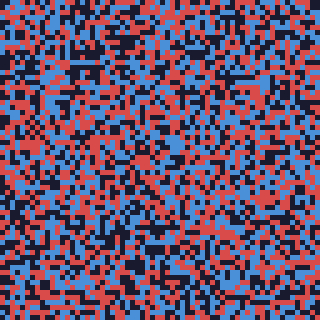

# Wheeler Memory

**A cellular automaton memory system with real semantic topology — not a vector database, not a retrieval engine, but a self-organising attractor landscape that knows what it knows and knows what it doesn't.**

[](https://creativecommons.org/licenses/by-nc/4.0/)

---

## What Is This?

Wheeler Memory encodes text into a 64x64 cellular automaton grid, evolves it through 3-state dynamics until it converges to a stable attractor (~40-50 ticks), and stores the resulting pattern. Similar concepts produce similar attractors. When you query, your input is evolved the same way and matched against stored attractors via Pearson correlation.

The system has two modes:

- **Wheeler-agent**: Wheeler provides context seasoning for a large LLM via Ollama
- **Wheeler-primary**: Wheeler IS the cognitive system — a small model (Qwen 1.5B) acts as a pure language renderer for Wheeler's attractor state, with no independent reasoning

Memories have temperature — frequently recalled memories stay warm, stale ones cool and can be archived. Recall is reconstructive: stored attractors blend with query context and re-evolve, so the same memory reconstructs differently depending on what you're thinking about.

---

## Quick Start

```bash
git clone https://github.com/fantomx42/wheeler-memory.git
cd wheeler-memory
pip install -e ".[embed]"
```

> **No GPU required.** CPU works fine. Python 3.11+ required.

### Store and recall memories

```bash
wheeler-store --embed "self-attention computes relationships between all positions"
wheeler-recall --embed "how does attention work in transformers"
```

### Pre-train from a corpus

```bash
wheeler-crystallize corpus.jsonl --verbose
```

### Run the Wheeler-primary agent (needs Ollama)

```bash
wheeler-primary --interactive --show-state --verbose
```

### Launch the web dashboard

```bash
wheeler-ui    # opens http://localhost:7437
```

---

## What Does It Look Like?



*A random 64x64 grid converging to a stable attractor through 3-state CA dynamics.*

---

## Architecture

```
                    ENCODING
                    ────────
Text ──→ Sentence Transformer (384-dim)
              │
              ▼
     JL Random Projection (384 → 4096)
              │
              ▼
     Reshape to 64×64 grid, quantize to {-1, 0, +1}
              │
              ▼
     CA Evolution (~40-50 ticks to convergence)
              │
              ▼
         Attractor (64×64 stable pattern)
              │
              ▼
    Store: attractor + brick + metadata
              │
              ▼
    Chunked storage (code / science / general / ...)


                    RECALL
                    ──────
Query ──→ Same encoding pipeline ──→ Query attractor
              │
              ▼
     Pearson correlation against all stored attractors
              │
              ▼
     Top-K hits ranked by similarity
              │
              ▼
     [Optional] Reconstructive recall:
       blend stored attractor with query context,
       re-evolve through CA → reconstructed memory


               WHEELER-PRIMARY MODE
               ────────────────────
Query ──→ Recall from attractor landscape
              │
              ▼
     Extract state: confidence, co-activations, depth
              │
              ▼
     Format structured prompt with CA metadata
              │
              ▼
     Small model renders natural language from state
     (no independent reasoning — pure decoder)
```

The CA uses a 3-state rule: local peaks push toward +1, valleys toward -1, slopes flow uphill. Convergence takes ~3ms on CPU. The Johnson-Lindenstrauss random projection preserves semantic neighborhoods — similar embeddings produce similar attractors.

---

## Empirical Results

Validated on a corpus of 2711 memories (26.9% grid saturation):

### Semantic Apple Test

Exclude a concept from its domain, crystallize all neighbors, query for the excluded concept. Does the topology predict the missing node?

| Domain | Verdict | Top Similarity | Embedding Advantage |
|--------|---------|---------------|-------------------|
| ML Architecture | **TOPOLOGY** | 0.251 | +0.251 over hash control |
| Physics | **TOPOLOGY** | 0.328 | +0.325 over hash control |
| Biology | weak topology | 0.149 | +0.147 over hash control |

**The system has real geometry, not just lookup.** Quantum entanglement (excluded) fires quantum superposition (top hit, 0.328). Transformer architecture (excluded) fires feed-forward networks and self-attention.

### Decoder Confidence Gradient

| Attractor Depth | Avg Top Similarity | Uncertain |
|----------------|-------------------|-----------|
| Deep (crystallized) | 0.409 | 0% |
| Shallow (related) | 0.248 | 0% |
| Missing (out of domain) | 0.193 | 67% |

The system knows what it knows, knows what it doesn't, and knows the difference.

### Co-Activation Topology

Bridge sentences — text discussing multiple concepts together — create measurable attractor overlap:

| Concept Pair | Before Bridge | After Bridge |
|-------------|--------------|-------------|
| quantum superposition / entanglement | 1.000 | 1.000 (natural) |
| photosynthesis / mitochondria | 0.000 | 0.250 |
| self-attention / transformer | 0.000 | 0.111 |
| BERT / GPT | 0.000 | 0.111 |
| cross-domain (ML / physics) | 0.000 | 0.000 (correct isolation) |

---

## Corpus Crystallization

Pre-train Wheeler by feeding text corpora through the full pipeline at scale:

```bash
# Prepare a corpus (JSONL, CSV, TXT, or Parquet)
echo '{"text": "concept description here"}' > corpus.jsonl

# Crystallize with semantic embeddings
wheeler-crystallize corpus.jsonl --verbose --batch-size 64

# Resume support — re-running skips already-stored entries
wheeler-crystallize corpus.jsonl --verbose  # only processes new items
```

Supported formats: JSONL (`{"text": "..."}` per line), CSV (column named `text`), TXT (one entry per line), Parquet (auto-detects text column).

The included corpus preparation script extracts from SWE-bench, mbpp, LongBench, and curated domain entries:

```bash
python scripts/prepare_corpus.py   # → datasets/corpus.jsonl (2711 entries)
```

---

## CLI Reference

### Core Operations

| Command | Description |
|---------|-------------|
| `wheeler-store "text"` | Store a memory (add `--embed` for semantic) |
| `wheeler-recall "text"` | Find similar memories (add `--embed` for semantic) |
| `wheeler-forget --text "text"` | Delete a specific memory |
| `wheeler-temps` | View all memories with temperature/freshness |
| `wheeler-sleep` | Archive cold memories to save space |

### Agents

| Command | Description |
|---------|-------------|
| `wheeler-agent` | LLM chat agent with Wheeler context (needs Ollama) |
| `wheeler-primary` | Wheeler-primary agent — small model as pure decoder (needs Ollama) |
| `wheeler-primary --interactive` | Interactive conversation mode |
| `wheeler-primary --show-state` | Display attractor state alongside responses |

### Pre-Training

| Command | Description |
|---------|-------------|
| `wheeler-crystallize corpus.jsonl` | Crystallize a text corpus into attractor landscape |
| `wheeler-crystallize --no-embed` | Use hash-based encoding instead of embeddings |
| `wheeler-crystallize --max-items 1000` | Cap processing for validation runs |

### Diagnostics

| Command | Description |
|---------|-------------|
| `wheeler-ui` | Web dashboard at http://localhost:7437 |
| `wheeler-scrub --text "text"` | Visualise how a memory formed (brick inspector) |
| `wheeler-info` | System info (hardware, GPU, paths) |
| `wheeler-bench-gpu` | Benchmark GPU vs CPU evolution speed |

### Evaluation Scripts

```bash
python scripts/apple_test_semantic.py          # Semantic holdout test
python scripts/eval_decoder.py                 # Decoder quality by attractor depth
python scripts/eval_decoder.py --decode        # Also run small model (needs Ollama)
python scripts/topology_map.py                 # Co-activation adjacency map
```

---

## Key Concepts

### Attractor Landscape

Every stored memory is a fixed-point in CA dynamics. The collection of all stored attractors forms a landscape with topological structure — semantically related concepts occupy nearby basins. This topology is not designed; it emerges from the interaction between semantic embeddings, random projection, and CA evolution.

### Temperature System

Memories have temperature based on access frequency and time decay (7-day half-life). Hot memories are prioritized during recall. Cold memories can be archived via `wheeler-sleep`. Temperature tiers: `hot > warm > cool > cold > frozen`.

### Reconstructive Recall (Darman)

Recall is not retrieval. When a stored attractor is recalled, it blends with the query context at a configurable alpha and re-evolves through the CA. The result is a reconstruction shaped by current context — the same memory comes back differently depending on what you're thinking about.

### Chunked Storage

Memories are auto-routed to domain chunks (`code`, `science`, `hardware`, `daily_tasks`, `meta`, `general`) via keyword matching. Each chunk maintains its own attractor index, enabling domain-specific recall and capacity management. Maximum capacity: 10,000 attractors.

### Confidence Signal

In Wheeler-primary mode, confidence is derived from the top Pearson similarity of recalled attractors (floor: 0.18). The CA evolution compresses the similarity range relative to raw embedding space — thresholds are calibrated to CA-space values, not embedding-space intuitions.

### Bridge Sentences

Corpus entries that discuss multiple concepts together create measurable attractor overlap (co-activation bridges). Isolated definitions produce strong individual attractors but weak inter-concept connections. Effective corpus design requires connective tissue — textbook prose, not dictionary entries.

---

## Project Structure

```
wheeler_memory/           Core library
  dynamics.py               CA engine (3-state evolution, GPU dispatch)
  embedding.py              Sentence transformer + JL random projection
  hashing.py                SHA-256 deterministic encoding
  storage.py                Store/recall with chunked Pearson search
  reconstruction.py         Darman reconstructive recall
  decoder.py                Wheeler-primary agent (small model as decoder)
  crystallization.py        Corpus pre-training pipeline
  temperature.py            Temperature/warmth tracking
  chunking.py               Domain routing (keyword-based)
  brick.py                  Memory brick format (.npz archives)
  agent.py                  LLM agent with Wheeler context
  gpu_dynamics.py           HIP/CUDA kernel dispatch
  attention.py              Salience-weighted recall
  warming.py                Association tracking
  theories/                 Theory experiments (basin analysis, resonance, synthesis)

scripts/                  CLI entry points + evaluation tools
  wheeler_primary.py        Wheeler-primary CLI
  wheeler_crystallize.py    Crystallization CLI
  apple_test_semantic.py    Semantic holdout test
  eval_decoder.py           Decoder quality evaluation
  topology_map.py           Co-activation mapping
  prepare_corpus.py         Corpus preparation from datasets

tests/                    208 tests across 17 test files
ui/                       Web dashboard + interactive demo
docs/                     Architecture, concepts, CLI, GPU, installation guides
open_webui_setup/         OpenWebUI LLM integration
wheeler_3d_viewer/        3D attractor landscape viewer
datasets/                 Training corpora (SWE-bench, mbpp, LongBench, curated)
```

---

## Learn More

- [Installation Guide](docs/install.md) — venv setup, platform-specific notes, GPU acceleration, Ollama
- [Interactive Demo](ui/demo.html) — see the CA engine in your browser (open as a file, no server)
- [Architecture](docs/architecture.md) — CA dynamics, temperature system, chunked storage, the math
- [Concepts](docs/concepts.md) — theoretical foundation, reconstructive recall, semantic vs exact search
- [Design Principles](docs/design.md) — the Darman philosophy
- [CLI Reference](docs/cli.md) — every flag documented
- [API Reference](docs/api.md) — Python library usage
- [GPU Acceleration](docs/gpu.md) — HIP/ROCm and CUDA setup

---

## Related Tools

- **OpenWebUI Integration** (`open_webui_setup/`) — inject Wheeler memories into any LLM conversation
- **3D Viewer** (`wheeler_3d_viewer/`) — explore attractor landscapes in 3D

---

**Darman doesn't retrieve. Darman reconstructs.**
